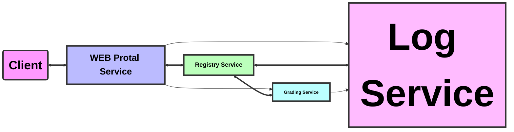

# GO-DISTRIBUTED

## 项目结构

    $ go mod tidy
    D:\Distributed-Simple
    ├─cmd  //项目启动入口
    ├─grades //demo学生成绩服务模块
    ├─log  //log日志模块
    ├─registry  //服务注册模块
    ├─service  //服务启动模块
    └service  //服务启动模块

## 思维导图

